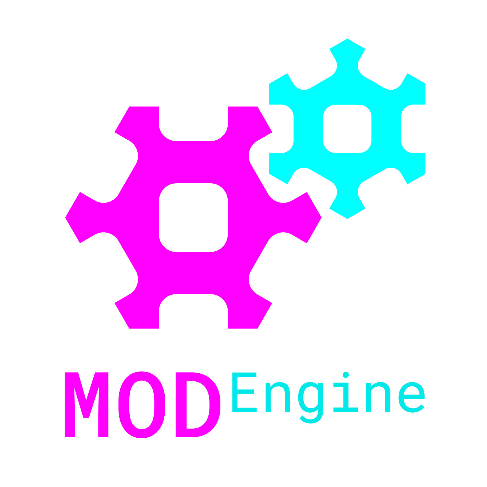

ModEngine is a C++ game engine project, designed to be highly modifiable by the end-user, but in a way that supports medium to high performance requirements. The initial/standard engine components and systems will center around top-down games that do not employ real time physics, first person cameras, etc, and instead utilize in-depth world mechanics/simulations. This engine is designed to suit a specific type of game design and most of the decisions are driven by this underlying goal. It is not a universal solution, but if your goals fit within its niche, it aims to be a competitive solution with intelligent tradeoffs.


## Planned Features
+ Entity Component System abstraction
+ Native extension modules
+ 3D graphics w/ skeletal animation, lighting, etc
+ 2D audio
+ Immediate mode UI
+ Fully featured level editor (also extensible)


## Code Basis
All dependencies are embedded in the source tracking so no extra downloads or build steps are necessary. This also allowed adaptation of the headers where necessary. It may make updating a bit more difficult but all of the APIs used are fairly stable so it shouldn't be too much of an issue. All sources utilize free, open source, or public domain licenses; see their respective directories for details

+ SDL2 ([zlib](http://libsdl.org/license.php))
  > https://www.libsdl.org/download-2.0.php

+ FreeImage ([FreeImage Public](http://freeimage.sourceforge.net/freeimage-license.txt))
  > http://freeimage.sourceforge.net/index.html

+ GL3W / OpenGL 4 ([Unlicense](https://github.com/skaslev/gl3w/blob/master/UNLICENSE) / None)
  > https://github.com/skaslev/gl3w

  > https://www.khronos.org/opengl/

+ Dear ImGUI ([MIT](https://github.com/ocornut/imgui/blob/master/LICENSE.txt))
  > https://github.com/ocornut/imgui

+ ImGuiColorTextEdit ([MIT](https://github.com/BalazsJako/ImGuiColorTextEdit/blob/master/LICENSE))
  > https://github.com/BalazsJako/ImGuiColorTextEdit

+ tinycthread ([zlib](https://github.com/tinycthread/tinycthread/blob/master/README.txt#L71))
  > https://github.com/tinycthread/tinycthread

+ StackWalker (Used for indepth memory debug mode during development only) ([BSD3](https://github.com/JochenKalmbach/StackWalker/blob/master/LICENSE))
  > https://github.com/JochenKalmbach/StackWalker


## Third Party Assets
All assets used by the engine or test game utilize open source or public domain licenses, see their respective directories for details

- Fonts
  + ProggyClean ([MIT](https://github.com/bluescan/proggyfonts/blob/master/LICENSE))
    > http://upperbounds.net/

  + Roboto ([Apache 2.0](https://github.com/google/roboto/blob/master/LICENSE))
    > https://fonts.google.com/specimen/Roboto

  + Teko ([Open Font](http://scripts.sil.org/cms/scripts/page.php?site_id=nrsi&id=OFL_web))
    > https://fonts.google.com/specimen/Teko


## Project Status
This is still early in production, but a list of architectural elements that have been implemented to some degree is as follows:
+ Various generic data structures:
  - Bitmask (Bit flag set template)
  - Dynamic array (Template)
  - Dynamic string (ASCII-only for now)
  - Shared Library
  - ThreadPool
+ UI through SDL + ImGUI
+ Input to generic Control binding abstractionwith config file i/o
+ Source file editor with ImGuiColorTextEdit
+ JSON parser + stringifier
+ XML parser + stringifier
+ ECS (Highly experimental)
+ Application window abstraction with config file i/o
+ Extensive linear algebra library including:
  - 2d and 3d vectors
  - 3x3 and 4x4 matrices
  - Euler and Quaternion rotations
  - 2d and 3d component transforms (Scale + Rotation + Translation)
  - 2d and 3d geometric primitives
  - 2d and 3d intersection and distance tests
+ Image i/o and manipulation through FreeImage
+ Extensive graphics drawing abstractions with asset file i/o:
  - Shaders (Vertex, Fragment)
  - Shader programs
  - Textures
  - Materials
  - Material sets
  - 2d & 3d Meshes
  <!-- - Batched rendering (Speculative) -->
+ Asset manager:
  - JSON database files
  - Inline definitions for most asset types
  - Relative file path references to individual files
  - Assets are accessible by name or index
  - Definition priority is load order, later loads overwrite earlier loads
  - Automatic reloading of assets when source files are modified
  - Utilizes exceptions to prevent crashes from loading improperly formatted assets
+ Memory leak detector:
  - Tracks all nonstatic allocations to determine if anything is leaked by the program
  - Indepth memory debug compilation mode gives stack trace for all leaks


## Requirements
Currently this project only has Windows build scripts but some effort is being made to keep the code Linux friendly as well. If you would like to compile a Linux version it should be a simple matter of translating the batch file to a shell script and getting Linux builds of the dependencies. Clang is recommended for compilation. If you do get this running on Linux please consider submitting a pull request

### In order to build on Windows you will need:
+ Clang installed on the system PATH
  > http://releases.llvm.org/download.html

+ Visual Studio Community 2017 or the standalone Build Tools for Visual Studio 2017
  > https://visualstudio.microsoft.com/downloads/#build-tools-for-visual-studio-2017

  > Visual Studio Enterprise and Visual Studio Professional will also work but you will have to modify the paths in which the build script searches for the required files

+ Windows 10 SDK
  > Included in the default install configuration for either Visual Studio 2017 or the standalone Build Tools

#### Additional dependencies
The `package.bat` script depends on 7-Zip (https://www.7-zip.org/download.html) but this is not needed unless you intend to create .zip release distributions of the engine yourself

## Usage

### Install
Clone the repo by running
```
git clone https://github.com/noxabellus/mod-engine
```

### Build

#### Windows
Build by running `.\build.bat` followed by the names of the targets you want to build:
- `engine_debug` / `engine_release`
> Build the core ModEngine library `.dll` and `.lib` files. Copy the dependency `.dll` files and combine their `.lib` files with the ModEngine `.lib` file for easier linking. For Debug, create/copy `.pdb` files
- `include`
> Build the ModEngine redistributable header file collection
- `test_game_debug` / `test_game_release`
> Build the test game `.exe` and `.lib`, and combine the ModEngine `.lib` with it for easier linking
- `test_mod_debug` / `test_mod_release`
> Build the test module `.dll`

E.g. Build the debug engine, header files, test game, and test modification by running
```
.\build.bat engine_debug include test_game_debug test_mod_debug
```

You can prefix the build target names with `memory_debugging` to enable indepth memory debugging with stack traces on allocations. This is only recommended if a leak has been detected, as it will take several minutes to start up the binaries compiled in this mode.

E.g. Build the debug engine, etc with indepth memory debugging enabled by running
```
.\build.bat memory_debugging engine_debug include test_game_debug test_mod_debug
```

You may also delete all untracked files with the build script's `clear` command, followed by the names of the directories you want to delete

E.g. Delete the debug engine and debug test modification directories by running
```
.\build.bat clear debug test\debug\mods
```

> Note: You can also delete the full build directory by passing no extra parameters after `clear`

You may also run the built test game executables with the commands `run_debug` and `run_release`

E.g. A full rebuild and run can be done by running
```
.\build.bat engine_debug include test_game_debug test_mod_debug run_debug
```

Additionally, VS Code tasks are preconfigured for most actions in `.vscode/tasks.json`, and a debugger configuration is also available for stepping through the test game, in `.vscode/launch.json`

### Utilize
In order to use the engine in your own game there are a few steps to follow:
+ Copy the built include directory into your project
+ Copy the dependency dlls `ModEngine.dll`, `SDL2.dll`, `FreeImage.dll`, `text_editor.dll` and `imgui.dll` from the appropriate target (Debug or Release), and place them where your game's exe will be built
+ (Optional) If using the Debug target, copy the `.pdb` files from the engine directory
+ Include the `include/ModEngine.hh` header into your source
+ Define `M_GAME` so the headers have the appropriate Windows `__declspec`s
+ Link against the `ModEngine.lib` from the appropriate target when building
+ Create an assets directory in the working directory for your project containing:   
  - Debug primitive shaders 
    * `./assets/shaders/primitive.frag`
    * `./assets/shaders/primitive2.vert`
    * `./assets/shaders/primitive3.vert`
  - (Optional) One or more TrueType fonts, and an `./assets/application_config.json` (Path is configurable) with their paths and sizes

  (Or just copy the assets directory included with the engine)

To build modifications for your game there is a similar process. The module and asset loader system is not yet fully implemented, but for now the test framework is setup to support use of a DLL to simulate the capability. In order to build a module DLL:
+ (Optional) Combine your game's lib file with the engine's lib file for easy linking
+ Include the engine headers along with your game's headers into your source
+ Define `M_MODULE` so the headers have the appropriate Windows `__declspec`s
+ Link against the combined lib or both the engine lib and your game's lib


Communication between different binaries is facilitated by the use of `ENGINE_API`, `GAME_API`, and `MODULE_API`. Windows' use of `__declspec` requires that any symbols you wish to export be marked `__declspec(dllexport)` and any symbols you wish to import be marked with `__declspec(dllimport)`, so these macros are changed for a given compilation context by use of the `M_ENGINE`, `M_GAME`, and `M_MODULE` defines

For further details see the test game and modification source code and build script entries
